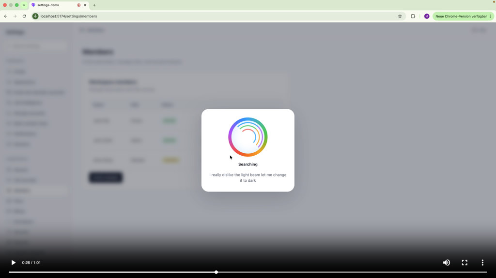

# cmdk-vectorized

Vector-database search for `cmdk` command palettes, with optional speech-to-text voice input.

Keep your existing command palette UI. Query a vector database (Weaviate) for ranked results instead of client-side filtering. Navigation, actions, and routing stay in your app — this package handles search hooks, result rendering, and optional voice transcription.

<a href="https://www.youtube.com/watch?v=JwHRA-bXtiA" target="_blank" rel="noopener noreferrer">
  
</a>

In the **[video demo](https://www.youtube.com/watch?v=JwHRA-bXtiA)** above, a vague typed query and speech-to-text voice input both hit the same vector search endpoint. Ranked results render in `cmdk`, and selecting one triggers app-owned navigation or an action handler.

Try it yourself here 👉 **[Live demo](https://settings-demo-redux.vercel.app)**

[API docs](./docs/api.md) · [AGENTS.md](./AGENTS.md) · [LLM guide](./docs/llm-guide.md)

## Looking for…

| You want to… | This package provides… |
|--------------|------------------------|
| Add vector search to a `cmdk` command palette | `useAICommand` + `createCommandSearchHandler` |
| Use Weaviate for semantic command search | CLI `init` + `upload` for intent maps |
| Add speech-to-text voice to a command palette | `CommandVoice` / `useCommandVoice` (Web Speech API) |
| Integrate with shadcn/ui `Command` | Drop-in `cmdk` hooks with `shouldFilter={false}` |

## Install

```bash
npm install cmdk-vectorized cmdk react react-dom
```

`cmdk` is also re-exported from this package as `Command`.

**Requirements:** `react`, `react-dom`, `cmdk`, and a backend search endpoint. Weaviate is recommended for semantic retrieval.

## Quick start

```tsx
import { Command, useAICommand } from "cmdk-vectorized";

export function CommandMenu() {
  const command = useAICommand({
    endpoint: "/api/command-search",
    navigate: (href) => {
      window.location.href = href;
    },
    actions: {
      "team.invite": () => openInviteModal(),
    },
  });

  return (
    <Command shouldFilter={false}>
      <Command.Input
        value={command.query}
        onValueChange={command.setQuery}
        placeholder="Search commands..."
      />
      <Command.List>
        {command.results.map((result) => (
          <Command.Item
            key={result.id}
            value={result.id}
            onSelect={() => {
              void command.execute(result);
            }}
          >
            {result.title}
          </Command.Item>
        ))}
      </Command.List>
    </Command>
  );
}
```

Render `<Command shouldFilter={false}>` so `cmdk` does not override vector-database ranking.

## Agentic setup

Install the integration skill for coding agents:

```bash
npx cmdk-vectorized integrate
```

Generate and upload a command corpus to Weaviate:

```bash
npx cmdk-vectorized init
```

```txt
public/intent-map.json
public/intent-map.csv
```

```bash
WEAVIATE_URL="https://example.weaviate.cloud" \
WEAVIATE_API_KEY="..." \
npx cmdk-vectorized upload
```

`cmdk-vectorized-agent` still works as a legacy alias.

## Example app

Redux-backed settings demo: [`examples/settings-demo-redux`](./examples/settings-demo-redux)

```bash
npx pnpm@10.12.4 install
npx pnpm@10.12.4 example:redux:dev
```

With Weaviate:

```bash
VITE_WEAVIATE_DATABASE_URL=your_cluster_url \
VITE_WEAVIATE_API_KEY=your_key_here \
npx pnpm@10.12.4 example:redux:dev
```

The example imports the local `src/index.ts` entry, so in-repo changes show up without publishing.

## Documentation

- [API reference](./docs/api.md) — hooks, result contract, server helpers, tooling
- [Local Weaviate playbook](./docs/local-weaviate.md) — copy-paste local dev setup

## Notes

- `href` values are app-owned. The package does not enforce routing conventions.
- Placeholder styles like `[workspaceId]`, `:workspaceId`, `{workspaceId}`, or `$workspaceId` are just examples.
- Use `href` for navigation results and `actionKey` for action results.
- Weaviate is recommended, not required.