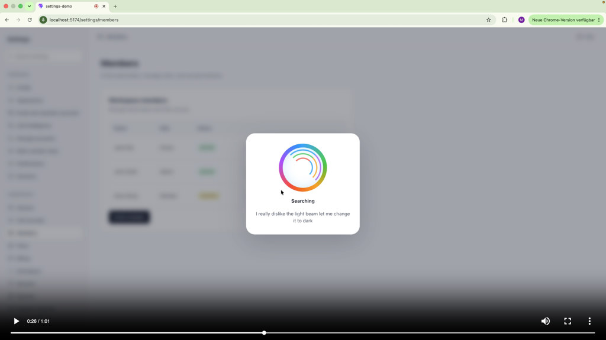

# cmdk-vectorized

Vector search for React command palettes, from intent discovery to ranked UI results.

`cmdk-vectorized` keeps matching on the backend and execution in the host app. It supports an existing `cmdk` UI, a styled drop-in palette, and optional browser speech input.

<a href="https://www.youtube.com/watch?v=JwHRA-bXtiA">
  
</a>

[Live demo](https://settings-demo-redux.vercel.app) · [API reference](./docs/api.md) · [Local Weaviate setup](./docs/local-weaviate.md)

## How it fits together

```txt
app routes and actions
  -> intent-map.json (optional CLI workflow)
  -> Weaviate or SupaSearch
  -> GET /api/command-search?q=...&limit=...
  -> useAICommand / useCommandVoice
  -> app-owned navigate(href) or actions[actionKey]()
```

The same endpoint serves typed and transcribed queries. `cmdk` local filtering stays off so backend ranking is preserved.

## Install

```bash
npm install cmdk-vectorized cmdk react react-dom
```

React 18 and 19 are supported.

## Drop-in palette

```tsx
import { AICommandPalette } from "cmdk-vectorized";
import "cmdk-vectorized/styles.css";

export function AppCommands() {
  return (
    <AICommandPalette
      endpoint="/api/command-search"
      navigate={(href) => window.location.assign(href)}
      actions={{ "team.invite": () => openInviteModal() }}
    />
  );
}
```

The default shortcuts are ⌘/Ctrl+K for text and ⌘/Ctrl+M for voice. Styles are scoped under `.cmdk-ai`.

## Existing `cmdk` UI

```tsx
import { Command, useAICommand } from "cmdk-vectorized";

export function CommandMenu() {
  const command = useAICommand({
    endpoint: "/api/command-search",
    navigate: (href) => router.push(href),
  });

  return (
    <Command shouldFilter={false}>
      <Command.Input value={command.query} onValueChange={command.setQuery} />
      <Command.List>
        {command.results.map((result) => (
          <Command.Item
            key={result.id}
            value={result.id}
            onSelect={() => void command.execute(result)}
          >
            {result.title}
          </Command.Item>
        ))}
      </Command.List>
    </Command>
  );
}
```

Use `useAICommandSearch` for search state only, `useCommandVoice` for speech, or `useAICommandPalette` for a headless text/voice controller.

## Search endpoint

```ts
import { createCommandSearchHandler } from "cmdk-vectorized/search-handler";

export const GET = createCommandSearchHandler({
  search: ({ query, limit }) => searchVectorDatabase(query, limit),
});
```

The endpoint returns `{ results: CommandSearchResult[] }`. Navigation results carry `href`; action results carry `actionKey`. The host app owns routing, permissions, actions, and error reporting.

Hosted SupaSearch users can point `endpoint` at the SupaSearch API and pass a publishable Bearer key through `headers`.

## Intent tooling

Intent maps, agent skills, and Weaviate upload live in a separate package: **`cmdk-vectorized-cli`**.

```bash
npx cmdk-vectorized-cli integrate
npx cmdk-vectorized-cli init
WEAVIATE_URL="..." WEAVIATE_API_KEY="..." npx cmdk-vectorized-cli upload
```

- `integrate` installs concise integration guidance for coding agents.
- `init` installs the intent-map generation workflow.
- `upload` validates `public/intent-map.json`, writes CSV, and uploads to Weaviate.

## Repository layout

```txt
src/client/search    text search hooks + HTTP client
src/client/voice     speech, voice decisions, CommandVoice
src/client/palette   drop-in AICommandPalette
src/client/shared    shared React helpers and palette CSS
src/core             Result contracts, validation, command execution
src/search-handler   Framework-neutral Request -> Response helper
examples/settings-demo-redux   deployed end-to-end demo
```

The root and `/search-handler` entry points keep browser code separate from the HTTP helper.

## Design decisions

- Vector ranking is backend-owned; this is not an LLM chat abstraction.
- Results describe intent, while the app owns navigation and side effects.
- Voice uses the browser Web Speech API and the same result contract as text.
- Clear voice matches navigate directly; close competing destinations stay visible for selection.
- Runtime validation covers malformed contracts and failed requests without adding retries, caching, or provider-specific layers.

## Development

```bash
pnpm install
pnpm check
pnpm example:redux:dev
```

See [docs/api.md](./docs/api.md) for all options and [docs/llm-guide.md](./docs/llm-guide.md) for the dense integration reference.
